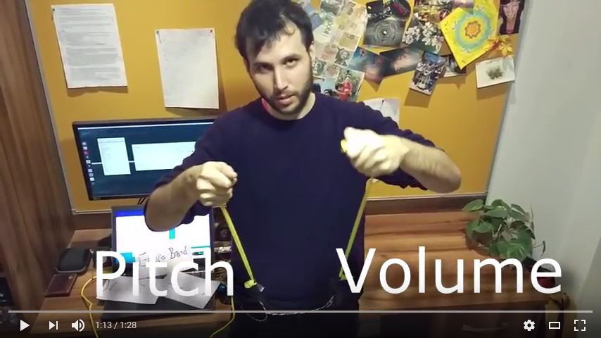

## What?

The Schleikess ("suspenders" in Yiddish) are my final project to the Interactive Digital Multimedia Techniques (ECS742P) module. My conference paper for the Research Methods (ECS719P) module is based on the same project. Both were developed in the Media and Arts Technology program, Queen Mary University of London.

## The concept

A controller for full-body interactive performances that requires applying force and effort to play with, hopefully facilitating expressiveness.
It is composed of two elastic bands that are attached to the players' belt loops, and a main unit that measures the tension on each elastic band.
The player holds the other side of each elastic band and stretches them to play.
The controller is demonstrated using a generative drum machine by mapping the stretch of the bands to tempo and the pitch of the samples.

[](https://www.youtube.com/watch?v=_BUf_VLCIWQ)

## System design


For more technical info see the [full report](report/report.md).

## How to run it?

1. Connect the two load cells to the arduino using one SparkFun HX711 load cell amplifier.

1. Upload the `scale_reader` sketch to the arduino.

1. When the arduino is connected to the computer run the `serial_to_osc` python script with:

  ```bash
  cd serial_to_osc
  virtualenv env  # using virtualenv is highly  recommended. First run only
  source env/bin/activate
  pip install -r requirements.txt  # First run only
  ./serial_to_osc.py
  ```

1. Open the Wekinator and load the project from `weki/project`.

1. Open the `player/main.pd` patch. On first run, make sure to install [`abl_link~`](https://github.com/libpd/abl_link). It's a dependency for the Pd patch that can be easily downloaded / installed with [`deken`](https://github.com/pure-data/deken).

1. Profit!
