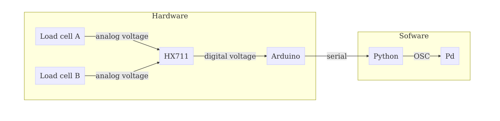

## What?

The Schleikess ("suspenders" in Yiddish) are my final project to the Interactive Digital Multimedia Techniques (ESC742P) module, Media and Arts Technology, Queen Mary University of London.

## The concept

A controller for full-body interactive performances that requires applying force and effort to play with, hopefully facilitating expressiveness.
It is composed of two elastic bands that are attached to the players' belt loops, and a main unit that measures the tension on each elastic band.
The player holds the other side of each elastic band and stretches them to play.
The controller is demonstrated using a generative drum machine by mapping the stretch of the bands to tempo and the pitch of the samples.

## System design



### The hardware

- I use [physiotherapy elastic bands](http://www.physioroom.com/images/products//full/38990_image2.jpg) as they are very stretchy and goes up to x3 their steady length. They also easily modified (cut / knot), making them ideal for DIY projects.

- The sensors are hacked [digital hanging scales](https://www.amazon.co.uk/PicknBuy®-20g-40kg-Portable-Electronic-Weighing/dp/B00695N01Q/). They are attached between the main unit and each elastic band to measure the applied force. The low signal from the two scales' load cells is amplified and converted to digital by a single [SparkFun HX711 load cell amplifier](https://www.sparkfun.com/products/retired/13230). To run at faster rate I cut the amplifier jumper and got a 8x speedup.

- The arduino reads the signals from the load cells and send them serially over USB to the computer.

### The software

- [The `scale_reader` arduino sketch](https://github.com/Nagasaki45/Schleikess/blob/master/scale_reader/scale_reader.ino) uses [my optimized version of bodge/HX711](https://github.com/nagasaki45/hx711) library to read the value from the HX711 and send the data over serial as comma separated strings.

- [The `serial_to_osc` python script](https://github.com/Nagasaki45/Schleikess/blob/master/serial_to_osc/serial_to_osc.py) reads the serial port and output the received data as OSC messages.

- A generative 16 steps drum machine, codded in pure data (Pd), is controlled by OSC messages (see figure below). The inputs for the drum machine are:

  - **Patterns generation period** - the time (in seconds) until a new pattern will be generate. A new pattern is generated only for one of the 8 samples each time, so there is a continuity.

  - **Density** - the probability for each of the 16  steps in a pattern to contain an onset.

  - **Curve** - weighting the density between the sequencers so sequencer number 0 has the true density value and the rest are gradually attenuated. It is important for allowing certain samples to be more dense than other (for example, hi-hat compared to kick).

  - **Rate** - a frequency multiplier for the samples.

  - **Variance** - to add randomness to the rate above.

  - **Tempo** - self explanatory :-).

- [The Wekinator](http://www.wekinator.org/) is used as a middleware between the python `serial_to_osc` script and the Pd patch to create an interesting mapping between input parameters (the tension of the elastic bands) and synthesis parameters.

During experimentation I found that mapping one band to the rate parameter and one to the tempo parameter yields the most simple yet interesting type of interaction.
Using more sophisticated mapping can be done easily with the help of the Wekinator but in the context of the supplied generative drum machine the relationship between the interaction and the resulted sound is less clear.


# How do I use it?

1. Connect the two load cells to the arduino using one SparkFun HX711 load cell amplifier.

1. Upload the `scale_reader` sketch to the arduino.

1. When the arduino is connected to the computer run the `serial_to_osc` python script with:

  ```bash
  cd serial_to_osc
  virtualenv env  # using virtualenv is highly  recommended. First run only
  source env/bin/activate
  pip install -r requirements.txt  # First run only
  ./serial_to_osc.py
  ```

1. Open the Wekinator and load the project from `weki/project`.

1. Open the `player/main.pd` patch. On first run, make sure to install [`abl_link~`](https://github.com/libpd/abl_link). It's a dependency for the Pd patch that can be easily downloaded / installed with [`deken`](https://github.com/pure-data/deken).

1. Profit!
