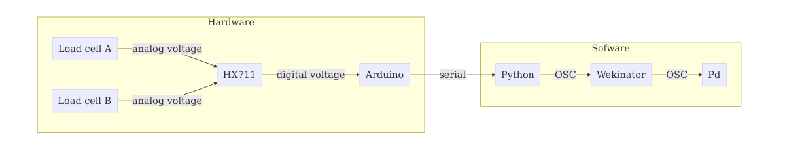
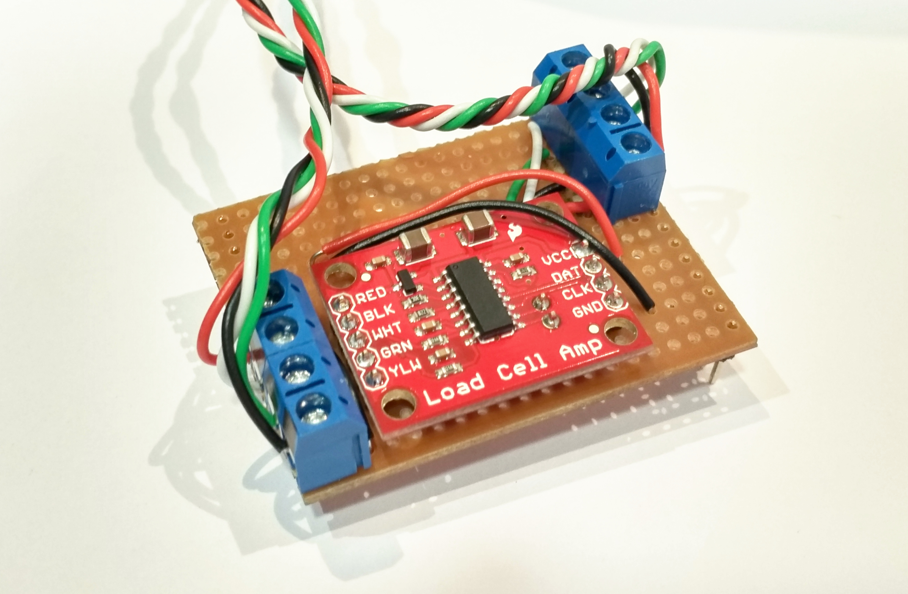
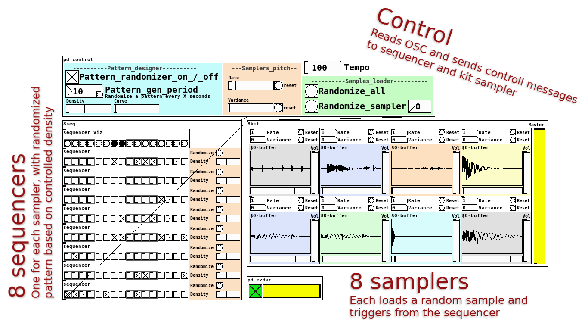
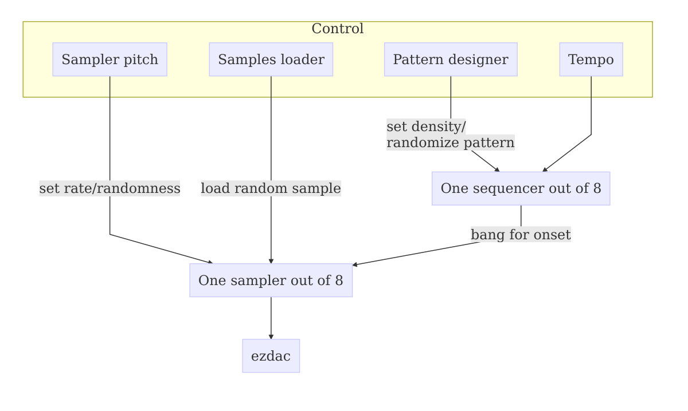

# Concept

In the current work I created a new interface for interactive live performances.
This interface requires large body movements to play but in the same time it applies force to resist the performer movement.
The expectation behind this type of interaction is to facilitate expressiveness due to the required force from the side of the performer.
The concept is realized using two elastics bands, each of which is connected with one side, using a load sensor, to the belt loop of the performer.
The other size is held by the performer that should stretch the elastic bands to play.

This controller can be used for different creative purposes.
In the context of this work it is demonstrated by controlling a 16 steps generative drum machine coded in pure data (Pd).

# System design

Figure \ref{system} shows a schematic diagram of the system and the means of communication between the different components.
The following sections describe each component and explain how it works.
A technical instruction for running the different components of the system together can be found in the [project README file](https://github.com/Nagasaki45/Schleikess#how-to-run-it).

## The hardware

The interaction with the interface is done through two elastic bands.
These are required to be stretchy as possible, to allow wide range of movement, but in the same time should be able to resist to the applied force.
Moreover, being easily modified (easy to cut / knot) is equally important to be used in such DIY project.
I found that [physiotherapy elastic bands](http://www.physioroom.com/images/products//full/38990_image2.jpg) are great for this purpose, as they are very stretchy and goes up to x5 their steady length.

To measure the tension of the elastic bands I used hacked [digital hanging scales](https://www.amazon.co.uk/PicknBuy-20g-40kg-Portable-Electronic-Weighing/dp/B00695N01Q/).
They form the physical connection between the elastic band and the belt loop.
Inside each scale there is a load-cell - a sensor that measures load and outputs very small current linearly to the load.
Therefor, the load can't be read with the arduino directly and an amplifier is required in between them.
I originally tried to hack the electronics of the hanging scale to be able to read their load cells, but apparently there is no simple way to do it.

As a solution, the low signal from the two scales' load cells is amplified and converted to digital by a single [SparkFun HX711 load cell amplifier](https://www.sparkfun.com/products/retired/13230).
This board can be modified to run at a higher speed by cutting a jumper on the PCB.
I did it to get a 8x speedup.

The last component in the hardware chain is the arduino, which reads the signals from the load cells and send them serially over USB to the computer.
To make the hardware easy to use I assembeld the SparkFun HX711 as an arduino shield as shown in figure \ref{shield}.

## The software

[The `scale_reader` arduino sketch](https://github.com/Nagasaki45/Schleikess/blob/master/scale_reader/scale_reader.ino) uses [my optimized version of bodge/HX711](https://github.com/nagasaki45/hx711) library to read the value from the HX711 and send the data over serial as comma separated strings.
The optimization I done is [discussed online](https://github.com/bogde/HX711/pull/55), but in general it reduce the time it takes to read two load cells with a single HX711 amplifier by half.

[The `serial_to_osc` python script](https://github.com/Nagasaki45/Schleikess/blob/master/serial_to_osc/serial_to_osc.py) reads the serial port and output the received data as OSC messages.
I decided to do this with python instead of processing or Pd only because it is easier for me to implement.

[The Wekinator](http://www.wekinator.org/) is used as a middleware between the python `serial_to_osc` script and the Pd patch to create an interesting mapping between input parameters (the tension of the elastic bands) and synthesis parameters.

### The pure data generative drum machine

Figure \ref{pd-patch} shows the Pd patch of the 16 steps generative drum machine.
It creates random patterns that gradually change over time with high level parameters to control the patterns generation and samples manipulations.

Figure \ref{pd-diagram} shows a diagram of the patch architecture.
The patch is centered around 8 sequencers, each of which generates a pattern for one of the 8 single voice samplers.
Each sequencer generates a 16 steps pattern in random, according to the density - the probability of a step to trigger an onset.
The `Pattern designer`, in addition to setting the general density of the sequencers, sends messages to the sequencers to generate new sequences.
These messages are sent to one sequencer at a time in a poisson process.
The parameter of the poisson process (the average time between events) is controlled by the `Pattern_gen_period` number box in the patch interface.

Two more controller components are the `Sampler pitch` and the `Samples loader`.
The `Sampler pitch` controller set the rate and the variance of all of the samplers.
The rate controls the play rate, and therefore the pitch of the sample, and the variance add randomness to this value.

The `tempo` controller is nothing more than a number box in the patch interface that can receive OSC messages.

All of the continuous high level parameters of the control section of the patch are controlled by OSC messages.
Namely, the controlled parameters are:

- **Patterns generation period** - the time (in seconds) until a new pattern will be generate. A new pattern is generated only for one of the 8 samples each time, so there is a continuity.

- **Density** - the probability for each of the 16 steps in a pattern to contain an onset.

- **Curve** - weighting the density between the sequencers so sequencer number 0 has the true density value and the rest are gradually attenuated. It is important for allowing certain samples to be more dense than other (for example, hi-hat compared to kick).

- **Rate** - a frequency multiplier for the samples.

- **Variance** - to add randomness to the rate above.

- **Tempo** - the overall tempo of the drum machine.

# Reflections

## Technical skills gained

For me, the main challenge in the project was the development of the hardware.
The process was full of uncertainty when I explored different ways to measure the force applied to the elastic bands.
The end result, in that manner, is one of the stronger parts of the project:
The form factor is almost exactly what I wanted from the beginning, and the sensors are very accurate and fast enough.

In addition, although Pd is far from being new to me, I think that the current patch is my best patch so far.
First, and regardless of the controller, I think that the result is artistically interesting.
Second, I tried to improve my coding style in Pd on the way.
Considering the re-usability of the subpatches I consider this as a success in writing better Pd code.
Finally, the interface ended visually clear and understandable.

## Interactivity

During experimentation with the interface and the Pd patch I found that mapping one band to the rate parameter and one to the tempo parameter yields the most simple yet interesting type of interaction.
Using more sophisticated mapping can be done easily with the help of the Wekinator but in the context of this generative drum machine the relationship between the interaction and the resulted sound is less clear.

In retrospective, I think that the interface and the Pd patch are doesn't match very well, and do not expose the strengths of each other.
The main reason for this is that the higher parameter space of the Pd patch is most suitable as a compository tool rather than for live performance.
The interesting part of the Pd patch is its ability to change gradually and continuously, discovering interesting patterns on the way.
The requirements from live performance instruments are quite different, as they should reflect the changes in the input field in a clearer way.

This problematic interaction is a result of running late with the submission of the project.
The first time that I tried the interface with the Pd patch was a day before submission.
Therefore, the most important lesson I'm learning from this project is to consider interactivity and usability first, and design the hardware and software around it.

# Additional information

- The software for the project can be found [on github](https://github.com/Nagasaki45/Schleikess).

- A video demonstration can be found [on youtube](TODO video).
